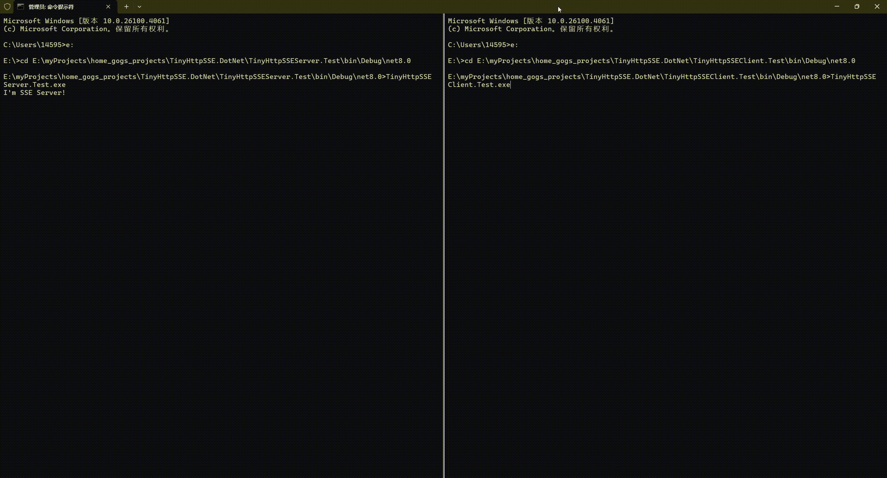

# TinyHttpSSE.DotNet
一个小而美的由C#实现的 Http1.1 SSE + Chunked 的工程，包含服务端与客户端实现

## SSE 简介
Server-Sent Events（SSE）是一种基于 HTTP 协议的服务器推送技术，它允许服务器以流的方式向客户端实时推送数据。与 WebSocket 等双向通信技术不同，SSE 专注于单向通信（从服务器到客户端），特别适合需要服务器主动推送数据的场景。

## 快速预览
- 以管理员身份运行 visual studio（监听SSE终结点需要管理员权限）
- 配置 TinyHttpSSEServer.Test,TinyHttpSSEClient.Test 为启动项目
- 启动运行，便可以看到以sse流打印的简介和实时报时

效果如图：


## 快速使用

1.服务端
```
HttpSseServer server = new HttpSseServer("http://+:9111/msg/");
server.Start();

server.StreamManagement.All.PushSseMsg("\r\nhello\r\n");
```
2.客户端（C#）
```
HttpSseClient httpSseClient = new HttpSseClient(url);
httpSseClient.ReceiveSseMsgEvent += (obj,msg)=> {
    Console.Write(msg);
};

bool result= httpSseClient.Connect();
```

## 高级用法

1.服务端
```
HttpSseServer:
public Func<HttpListenerContext, bool> VerifyClientFunc;   //可用于验证授权客户端
public Func<HttpListenerContext, BaseClientStream> StreamCreateFunc;   //可用于创建继承 BaseClientStream 的自定义类
public Action<BaseClientStream> StreamCreatedAction;   //可用于将以创建的 stream 放置于不同的组，设置心跳处理方法

//将 stream 放置于不同组，默认已在 server.StreamManagement.All 中
server.StreamManagement.PutInGroup("chat", stream);
server.StreamManagement.Groups["chat"].PushSseMsg("\r\nhello\r\n");   //推送某组流

server.StreamManagement.PutInGroup("book", stream);
server.StreamManagement.Others.Put(stream);

public abstract class BaseClientStream     //stream 的基类，可重写自定义处理方法
```
2.客户端
```
HttpSseClient:
public event EventHandler<byte[]> ReceiveByteEvent;    //优先于 ReceiveSseMsgEvent
public event EventHandler<string> ReceiveSseMsgEvent;
public event EventHandler ConnectBrokenEvent;          //断开事件
public event EventHandler EndOfStreamEvent;            //服务器告知流推送结束事件
```

## 不仅 SSE
尽管框架实现了 sse 通讯，但使用 sse 更多是为了与浏览器无缝衔接。当有与非浏览器客户端通讯的需求，则框架有了更多的想象空间，直接推送 byte——json字符串的字节数组、protobuf 或其他二进制流。

1.服务端
```
server.StreamManagement.All.PushBytes(Encoding.UTF8.GetBytes(Newtonsoft.Json.JsonConvert.SerializeObject(dict)));     //推送json字符串字节数组
```
2.客户端
```
//使用 ReceiveByteEvent 方法接收
 httpSseClient.ReceiveByteEvent +=(obj,byteArr)=>{                  
     Console.WriteLine(Encoding.UTF8.GetString(byteArr));
 };         
```

## 安装

1.nuget：

[TinyHttpSSE.DotNet.Server](https://www.nuget.org/packages/TinyHttpSSE.DotNet.Server/)

[TinyHttpSSE.DotNet.Client](https://www.nuget.org/packages/TinyHttpSSE.DotNet.Client/)

